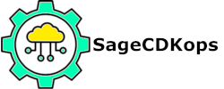

### Please note that this is a work in progress and meant for use with a ML specialist SA in a workshop setting.

## Prerequisites

### First install CDK

```
npm install -g aws-cdk
```

### Install/Upgrade python SDK
```
pip install --upgrade aws-cdk.cdk
```

Also see 

> https://docs.aws.amazon.com/cdk/latest/guide/getting_started.html#getting_started_update
> https://docs.aws.amazon.com/cdk/api/latest/python/index.html


# SageCDKops
To use, install requirements.txt in each project using

```
pip install -r requirements.txt
``` 

Or do

```
pip install -r all_requirements.txt
``` 

These projects have been tested with CDK version 1.0.0

## Use cases implemented so far:

1. Set up calls of SM endpoint on cron schedule for inference
2. Set up API gateway -> Lambda -> Sagemaker
3. Set up Step functions for batch inference
4. Notebook instanes for teams; multiple notebook instances with a common EFS volume, all in the same VPC
5. Set up retraining of model on cron schedule
6. Real time inference using Kinesis topics as inputs
7. Deploy model tagged as "production" based on config file 
8. Set up dask on Fargate with Sagemaker notebooks for distributed preprocessing

## Work in progress

2. Dataset/ experiment/ model versioning
3. PLEASE SUBMIT IDEA AS AN ISSUE


## Note on bootstrapping

If you get this error
"This stack uses assets, so the toolkit stack must be deployed to the environment (Run "cdk bootstrap aws://unknown-account/unknown-region")"

Run the cdk bootstrap command as seen above. This is true so far for the dask-fargate project

